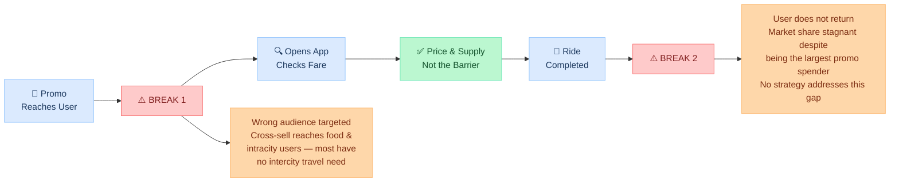
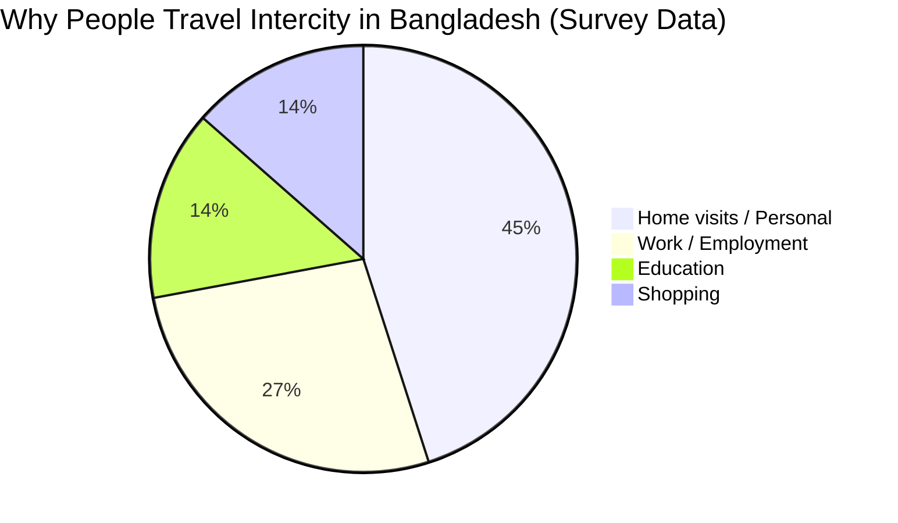
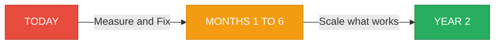

# Charting the Competitive Edge
## BI Strategy Framework for Intercity Market Dominance

---

> **The core problem in one line:**
> The company is the biggest promotional spender in the market — and still holds only 20% market share. Spending more is not the answer. Understanding *why* spend is not converting is.

---

## Task 1 — Diagnose the Problem

### Why are ride requests still low?

The strategies already in place — RFM segmentation, screen time targeting, discount cycles, cross-selling — are all reasonable on paper. But intercity travel is fundamentally different from food delivery or intracity rides. It is **occasion-driven, not habitual.** People do not book intercity rides three times a week. They book for major festivals, semester breaks, family emergencies, medical visits, or work trips — a handful of times a year at most. Every strategy built for a high-frequency product will underperform when applied to a low-frequency, high-intent category.

The first and most important hypothesis is that the promotions have no baseline to compare against. There is no control group — no set of users who did not receive the discount — so the company genuinely cannot know whether its promotions are creating new rides or simply subsidizing rides that would have happened anyway. When the biggest promotional spender in the market holds only 20% share, the most logical explanation is that a large portion of that spend is being absorbed by users who would have booked regardless.

The second hypothesis is that RFM segmentation is the wrong tool for this product. RFM scores users on how recently they bought, how often they buy, and how much they spend. This works well for food delivery, where people order multiple times a week. But a user who took four intercity trips last year and spent significantly is a loyal, high-value customer — yet their RFM score will flag them as "inactive" because their last trip was three months ago. The system then wastes re-engagement budget on someone who is already loyal, while missing genuinely new users with real travel intent.

The third hypothesis is that the product does not match how people plan intercity travel. When someone decides they are traveling to another city next weekend, they plan ahead — they do not open a ride app and hope a driver appears. The case notes that the product team has launched several new features to enhance booking experience and user convenience. The question is whether any of those features include scheduled or advance booking — because an on-demand-only product structurally cannot serve users who plan intercity trips days in advance. If the platform dispatches drivers only at the moment of request, it is missing the segment of travelers who need confirmed transport before they commit to a journey.

The fourth hypothesis is about trust and first impressions. Driver cancellations are a documented pain point in ride-hailing markets. For a five-hour intercity journey — where a user may have turned down a bus booking to use the app — a cancellation is catastrophic. If first-time intercity users are experiencing cancellations or poor experiences on their very first trip, they will not return. No promotional cycle compensates for a broken first impression.

The fifth hypothesis concerns timing. The current strategy uses app screen time to decide who to target. But high screen time in a super-app typically reflects food ordering or intracity usage — not intercity travel intent. The relevant moment to reach a potential intercity traveler is when they are actively planning a trip — before a major holiday, semester break, or long weekend — not on a random weekday when they opened the app to order food. Targeting based on screen time activity conflates engagement with the wrong product category.

The remaining hypotheses are worth noting briefly. Cross-selling to food and intracity users sends intercity promotions to a very broad audience where most users have no near-term intercity travel need. Zonal discounts are an intracity construct — intercity travel is defined by origin-destination pairs, not zones. And the three-discount monthly cycle risks training users to treat the discounted fare as the real price, creating long-term margin problems even as volume grows.

---

### Are promotions reaching the right users?

The simplest diagnostic is to split every promo redemption into three buckets and see where the majority of spend is landing:

- **Bucket 1 — Pure subsidy**: Users who have already completed intercity rides and would have booked again regardless. Promos here create zero incremental rides.
- **Bucket 2 — Cross-vertical conversion**: Users from food delivery or intracity who have never taken an intercity ride. Promos here *may* create a first trip.
- **Bucket 3 — Net new users**: First-time platform users. Promos here may drive acquisition.

Academic research on ride-hailing subsidy strategies confirms that the largest share of promo budget in mature platforms typically flows to repeat users, not net-new users — making accurate bucket attribution the first step before any spend decision (Zhu et al., 2023, *Short-term subsidy strategy for new users of ride-hailing platforms*, Computers & Industrial Engineering).

This analysis does not require a model — it only requires joining the promo redemption table to ride history and re-targeting based on prior intercity behavior.

---

### Where does the funnel break?

The intercity user funnel has more stages and higher stakes than an intracity one. A user who books a five-hour intercity journey is making a bigger commitment than someone ordering a 10-minute cab — which means every point of friction costs more. The case gives us enough evidence to identify where demand is leaking at each stage.

**What the case tells us at each stage:**

**Reach → Intent (first leak):** The three targeting methods — cross-selling to food and intracity users, screen-time targeting, and zonal discounts designed for intracity hotspots — all push intercity promotions to a broad audience where the majority have no near-term intercity travel need. The funnel is wide at the top and leaks immediately.

**Consideration → Request (not the problem):** The case explicitly states that user-facing fares after discounts are lower than all competitors, and that supply scales up with demand. Price and availability are therefore not the barriers here. The case has already ruled out this stage as the bottleneck.

**Completion → Return (second leak):** Market share is stagnant despite being the largest promotional spender. This is only possible if users are either not completing rides at a meaningful rate, or not returning after they do. Given that supply is not the constraint, the most likely explanation is that the first-ride experience — particularly for users acquired through broad cross-sell targeting who had low intent to begin with — is not strong enough to create a habit.

---

## Task 2 — Key Metrics

### What to measure — and why it matters

The company currently measures ride requests as its primary growth metric. The problem with this is that a campaign generating discounted rides from users who never return is not growth — it is expensive churn. The metrics below are designed to cut through that noise.

The most important metric to watch right now is the **first-to-second intercity trip conversion rate** — measured over a window that matches the natural cadence of intercity travel, not an arbitrary 30-day calendar month. If the majority of users who complete a first intercity ride do not book again, the platform is losing most users after a single trip. No top-of-funnel spend can fix a low repeat rate. This single number will tell the team whether the problem is in acquisition or in the product experience.

The second metric that matters is **net new intercity users per month** — not new sign-ups or new promo redemptions, but users who completed their very first intercity ride this month, minus users who went inactive. This is the real growth figure. In markets like Bangladesh, where major travel occasions (festivals, semester breaks, long weekends) concentrate demand into short windows, this metric will spike and dip seasonally. Tracking it week-over-week around high-demand windows reveals whether the platform is actually capturing those moments.

**Incremental ride lift from promotions** is the third critical metric — but it currently cannot be measured because no holdout group exists. Once the experiment runs, this becomes the only honest measure of whether promotional spend is generating any real value.

The remaining metrics follow logically. **Route-level completion rate** exposes supply and reliability problems that aggregate numbers hide. **Cost per incremental intercity ride** translates spend into real business output. **Post-promo full-price conversion rate** tests whether the discount cycle is creating loyal users or discount-dependent ones.

In Bangladesh specifically, intercity travel is driven primarily by home visits, employment, and education — not leisure or discretionary spending. Survey data on inter-city bus passengers in Bangladesh shows the following trip purpose distribution:

*Source: Hasan & Islam (2013), "Socio-economic conditions and travel behavior of inter-city bus passengers: Bangladesh perspective," ResearchGate / KUET. Note: categories overlap slightly across surveyed populations; figures represent weighted passenger proportions.*

> This is why RFM — which rewards recent and frequent activity — is structurally misaligned with intercity. Home visits, work travel, and education-driven trips are spaced weeks or months apart by nature. A user who took three intercity trips last year for exactly these reasons will *always* look dormant to an RFM system between trips, even though they are a loyal repeat customer.

<table style="width:100%;border-collapse:collapse;font-size:14px;margin:16px 0">
<thead>
<tr style="background:#dbeafe">
<th style="padding:12px 16px;text-align:left;font-weight:600;color:#1e3a5f;border-bottom:2px solid #93c5fd">Level</th>
<th style="padding:12px 16px;text-align:left;font-weight:600;color:#1e3a5f;border-bottom:2px solid #93c5fd">Metric</th>
<th style="padding:12px 16px;text-align:left;font-weight:600;color:#1e3a5f;border-bottom:2px solid #93c5fd">Formula</th>
<th style="padding:12px 16px;text-align:center;font-weight:600;color:#1e3a5f;border-bottom:2px solid #93c5fd">Priority</th>
</tr>
</thead>
<tbody>
<tr style="background:#eff6ff">
<td style="padding:12px 16px;font-weight:700;color:#1e40af">Business</td>
<td style="padding:12px 16px;color:#374151">Incremental intercity trips</td>
<td style="padding:12px 16px;color:#6b7280">Treatment rides − Control rides</td>
<td style="padding:12px 16px;text-align:center;font-weight:700;color:#dc2626">Urgent</td>
</tr>
<tr style="background:#eff6ff">
<td style="padding:12px 16px;font-weight:700;color:#1e40af">Business</td>
<td style="padding:12px 16px;color:#374151">Contribution margin per trip</td>
<td style="padding:12px 16px;color:#6b7280">Fare − driver payout − discount − fees</td>
<td style="padding:12px 16px;text-align:center;font-weight:700;color:#dc2626">Urgent</td>
</tr>
<tr style="background:#faf5ff">
<td style="padding:12px 16px;font-weight:700;color:#6b21a8">Demand</td>
<td style="padding:12px 16px;color:#374151">Net new intercity users / month</td>
<td style="padding:12px 16px;color:#6b7280">New first-timers − churned users</td>
<td style="padding:12px 16px;text-align:center;font-weight:700;color:#dc2626">Urgent</td>
</tr>
<tr style="background:#faf5ff">
<td style="padding:12px 16px;font-weight:700;color:#6b21a8">Demand</td>
<td style="padding:12px 16px;color:#374151">Route search to request conversion</td>
<td style="padding:12px 16px;color:#6b7280">Requests ÷ fare-checks</td>
<td style="padding:12px 16px;text-align:center;font-weight:700;color:#ea580c">High</td>
</tr>
<tr style="background:#f0fdf4">
<td style="padding:12px 16px;font-weight:700;color:#166534">Retention</td>
<td style="padding:12px 16px;color:#374151">First-to-second trip conversion rate</td>
<td style="padding:12px 16px;color:#6b7280">2nd trip completed ÷ first-trip users</td>
<td style="padding:12px 16px;text-align:center;font-weight:700;color:#dc2626">Urgent</td>
</tr>
<tr style="background:#fff7ed">
<td style="padding:12px 16px;font-weight:700;color:#9a3412">Promotion</td>
<td style="padding:12px 16px;color:#374151">Cost per incremental ride</td>
<td style="padding:12px 16px;color:#6b7280">Promo spend ÷ incremental rides</td>
<td style="padding:12px 16px;text-align:center;font-weight:700;color:#ea580c">High</td>
</tr>
<tr style="background:#fff7ed">
<td style="padding:12px 16px;font-weight:700;color:#9a3412">Promotion</td>
<td style="padding:12px 16px;color:#374151">Post-promo full-price conversion</td>
<td style="padding:12px 16px;color:#6b7280">Full-price bookings ÷ post-promo users</td>
<td style="padding:12px 16px;text-align:center;font-weight:700;color:#d97706">Medium</td>
</tr>
<tr style="background:#fdf4ff">
<td style="padding:12px 16px;font-weight:700;color:#86198f">Quality</td>
<td style="padding:12px 16px;color:#374151">First-ride completion rate</td>
<td style="padding:12px 16px;color:#6b7280">Completed first rides ÷ accepted first rides</td>
<td style="padding:12px 16px;text-align:center;font-weight:700;color:#ea580c">High</td>
</tr>
<tr style="background:#fefce8">
<td style="padding:12px 16px;font-weight:700;color:#854d0e">Route</td>
<td style="padding:12px 16px;color:#374151">Route-level completion rate</td>
<td style="padding:12px 16px;color:#6b7280">Completed ÷ accepted, per route</td>
<td style="padding:12px 16px;text-align:center;font-weight:700;color:#d97706">Medium</td>
</tr>
</tbody>
</table>

---

## Task 3 — Analytical Methodologies

### The Five Most Important Analyses

**1. Funnel Decomposition**
Map every drop-off stage in the booking funnel using app event logs. Cut by city, route, user source, and time of year. This identifies exactly where demand is dying — and shapes every other decision.

*KPIs this evaluates:* **Route search to request conversion** (is the drop happening before users even request?) · **Net new intercity users / month** (is the funnel generating genuinely new users or recirculating existing ones?) · **First-ride completion rate** (does the funnel deliver a completed first experience?)

---

**2. Promo Holdout Experiment** *(start this week)*

<table style="width:100%;border-collapse:collapse;font-size:14px;margin:16px 0">
<thead>
<tr style="background:#dbeafe">
<th style="padding:12px 16px;text-align:left;font-weight:600;color:#1e3a5f;border-bottom:2px solid #93c5fd;width:160px">Element</th>
<th style="padding:12px 16px;text-align:left;font-weight:600;color:#1e3a5f;border-bottom:2px solid #93c5fd">Detail</th>
</tr>
</thead>
<tbody>
<tr style="background:#f0fdf4">
<td style="padding:12px 16px;font-weight:600;color:#166534">Treatment</td>
<td style="padding:12px 16px;color:#374151">New intercity users receive the full 3-discount cycle as currently designed</td>
</tr>
<tr style="background:#fef2f2">
<td style="padding:12px 16px;font-weight:600;color:#991b1b">Control</td>
<td style="padding:12px 16px;color:#374151">Randomly assigned users receive 1 discount only — randomly assigned at signup, not self-selected</td>
</tr>
<tr style="background:#eff6ff">
<td style="padding:12px 16px;font-weight:600;color:#1e40af">Duration</td>
<td style="padding:12px 16px;color:#374151">90 days — long enough to observe at least one repeat trip given the natural spacing of intercity travel occasions</td>
</tr>
<tr style="background:#eff6ff">
<td style="padding:12px 16px;font-weight:600;color:#1e40af">Primary metric</td>
<td style="padding:12px 16px;color:#374151">Total intercity trips completed per user within the measurement window</td>
</tr>
<tr style="background:#faf5ff">
<td style="padding:12px 16px;font-weight:600;color:#6b21a8">Guardrail</td>
<td style="padding:12px 16px;color:#374151">First-ride completion rate must not fall in either group</td>
</tr>
<tr style="background:#fefce8">
<td style="padding:12px 16px;font-weight:600;color:#854d0e">Decision rule</td>
<td style="padding:12px 16px;color:#374151">If treatment shows no statistically significant lift over control, the extra two discounts generate no incremental rides — redirect that budget to supply quality and zone-level fixes</td>
</tr>
</tbody>
</table>

This experiment costs nothing to design. Not running it means every budget decision is unjustifiable.

*KPIs this evaluates:* **Incremental intercity trips** (the primary output) · **Cost per incremental ride** (the efficiency measure — only computable once a control group exists) · **Post-promo full-price conversion** (does the discount cycle create loyal users or price-dependent ones?) · **Contribution margin per trip** (does adding two extra discounts make each trip unprofitable?)

---

**3. RFM Suitability Audit**
For each RFM segment, calculate the intercity ride conversion rate. If there is no meaningful difference between "Champions" and "At Risk" segments in terms of intercity trips taken, RFM has no predictive power for this vertical. Also check what vertical drove each user's RFM score — a "Champion" who earned their score through food delivery is not an intercity prospect.

*KPIs this evaluates:* **Net new intercity users / month** (are the users RFM targets actually new to intercity, or existing riders?) · **Cost per incremental ride** (if RFM targeting is misdirected, every promo sent through it is wasted spend)

---

**4. Cohort Retention Analysis**
Group first-time intercity users by the month of their first trip. Track rides in Month 1, Month 2, and Month 3. If no cohort retains meaningfully better than average, the platform has not yet found its retention formula — and top-of-funnel spend must pause until the product experience is fixed.

*KPIs this evaluates:* **First-to-second trip conversion rate** (the core retention metric — this analysis reveals whether any cohort has cracked it) · **Net new intercity users / month** (retention failure means net new users stays flat even as acquisition grows)

---

**5. Product Feature Evaluation**
The case states the product team has launched several new features. Every feature needs one primary metric to move — not just adoption numbers. High feature usage does not equal business impact.

*KPIs this evaluates:* **First-ride completion rate** (booking convenience features should reduce drop-off before the first ride completes) · **Route-level completion rate** (driver quality filters should lift this per route) · **First-to-second trip conversion rate** (if advance booking or quality filters work, repeat rate should improve measurably)

<table style="width:100%;border-collapse:collapse;font-size:14px;margin:16px 0">
<thead>
<tr style="background:#dbeafe">
<th style="padding:12px 16px;text-align:left;font-weight:600;color:#1e3a5f;border-bottom:2px solid #93c5fd">Feature Type</th>
<th style="padding:12px 16px;text-align:left;font-weight:600;color:#1e3a5f;border-bottom:2px solid #93c5fd">Primary Metric to Move</th>
<th style="padding:12px 16px;text-align:left;font-weight:600;color:#1e3a5f;border-bottom:2px solid #93c5fd">Guardrail (Must Not Worsen)</th>
</tr>
</thead>
<tbody>
<tr style="background:#eff6ff">
<td style="padding:12px 16px;font-weight:600;color:#1e40af">Scheduling / advance booking</td>
<td style="padding:12px 16px;color:#374151">Request-to-completion rate for scheduled rides</td>
<td style="padding:12px 16px;color:#374151">Driver cancellation rate</td>
</tr>
<tr style="background:#f0fdf4">
<td style="padding:12px 16px;font-weight:600;color:#166534">Driver quality filters</td>
<td style="padding:12px 16px;color:#374151">Repeat trip conversion rate</td>
<td style="padding:12px 16px;color:#374151">Wait time at pickup</td>
</tr>
<tr style="background:#faf5ff">
<td style="padding:12px 16px;font-weight:600;color:#6b21a8">Booking convenience</td>
<td style="padding:12px 16px;color:#374151">Search-to-request conversion rate</td>
<td style="padding:12px 16px;color:#374151">Support ticket rate</td>
</tr>
</tbody>
</table>

---

### Health Check: Existing Strategies

<table style="width:100%;border-collapse:collapse;font-size:14px;margin:16px 0">
<thead>
<tr style="background:#dbeafe">
<th style="padding:12px 16px;text-align:left;font-weight:600;color:#1e3a5f;border-bottom:2px solid #93c5fd">Strategy</th>
<th style="padding:12px 16px;text-align:left;font-weight:600;color:#1e3a5f;border-bottom:2px solid #93c5fd">Health Check Question</th>
<th style="padding:12px 16px;text-align:left;font-weight:600;color:#1e3a5f;border-bottom:2px solid #93c5fd">Pass Condition</th>
<th style="padding:12px 16px;text-align:left;font-weight:600;color:#1e3a5f;border-bottom:2px solid #93c5fd">Risk If Failing</th>
</tr>
</thead>
<tbody>
<tr style="background:#faf5ff">
<td style="padding:12px 16px;font-weight:600;color:#6b21a8">RFM segmentation</td>
<td style="padding:12px 16px;color:#374151">Do high-RFM users convert to intercity at a meaningfully higher rate than low-RFM users?</td>
<td style="padding:12px 16px;color:#374151">Statistically significant conversion gap between segments</td>
<td style="padding:12px 16px;color:#374151">Segmentation has no predictive power for intercity — budget is being targeted on the wrong signal</td>
</tr>
<tr style="background:#fefce8">
<td style="padding:12px 16px;font-weight:600;color:#854d0e">Screen time targeting</td>
<td style="padding:12px 16px;color:#374151">Does high app screen time correlate with upcoming intercity bookings?</td>
<td style="padding:12px 16px;color:#374151">Positive and statistically meaningful correlation specific to intercity</td>
<td style="padding:12px 16px;color:#374151">Wrong signal — reflects food and intracity usage, not intercity travel intent</td>
</tr>
<tr style="background:#fef2f2">
<td style="padding:12px 16px;font-weight:600;color:#991b1b">3-discount cycle</td>
<td style="padding:12px 16px;color:#374151">Does the promo group complete more rides than the control group?</td>
<td style="padding:12px 16px;color:#374151">Statistically significant positive lift — requires holdout experiment to measure at all</td>
<td style="padding:12px 16px;color:#374151">Spending budget with no measurable incremental return</td>
</tr>
<tr style="background:#f0fdf4">
<td style="padding:12px 16px;font-weight:600;color:#166534">Zonal discounts</td>
<td style="padding:12px 16px;color:#374151">Do discount zones show higher ride volume than comparable non-discount zones?</td>
<td style="padding:12px 16px;color:#374151">Statistically significant uplift in treated zones vs comparable control zones</td>
<td style="padding:12px 16px;color:#374151">Subsidizing rides that would have happened without the discount</td>
</tr>
<tr style="background:#fff7ed">
<td style="padding:12px 16px;font-weight:600;color:#9a3412">Cross-selling</td>
<td style="padding:12px 16px;color:#374151">What share of cross-sell campaign users complete an intercity trip in a defined window after receiving the promo?</td>
<td style="padding:12px 16px;color:#374151">Conversion rate materially above the organic intercity baseline for the same user type</td>
<td style="padding:12px 16px;color:#374151">Budget burning on users with no near-term intercity travel need</td>
</tr>
</tbody>
</table>

---

## Task 4 — Strategic Recommendations

### Stop / Start / Continue

<table style="width:100%;border-collapse:collapse;font-size:14px;margin:16px 0">
<thead>
<tr style="background:#dbeafe">
<th style="padding:12px 16px;text-align:center;font-weight:600;color:#1e3a5f;border-bottom:2px solid #93c5fd;width:80px">Signal</th>
<th style="padding:12px 16px;text-align:left;font-weight:600;color:#1e3a5f;border-bottom:2px solid #93c5fd">What</th>
<th style="padding:12px 16px;text-align:left;font-weight:600;color:#1e3a5f;border-bottom:2px solid #93c5fd">Why</th>
</tr>
</thead>
<tbody>
<tr style="background:#fef2f2">
<td style="padding:12px 16px;text-align:center;font-weight:700;color:#dc2626">STOP</td>
<td style="padding:12px 16px;color:#374151">Promo spend without a holdout group</td>
<td style="padding:12px 16px;color:#374151">Cannot justify any spend without knowing what is incremental</td>
</tr>
<tr style="background:#fef2f2">
<td style="padding:12px 16px;text-align:center;font-weight:700;color:#dc2626">STOP</td>
<td style="padding:12px 16px;color:#374151">Using RFM for intercity targeting until audit confirms otherwise</td>
<td style="padding:12px 16px;color:#374151">Structurally wrong for low-frequency, occasion-driven travel</td>
</tr>
<tr style="background:#fef2f2">
<td style="padding:12px 16px;text-align:center;font-weight:700;color:#dc2626">STOP</td>
<td style="padding:12px 16px;color:#374151">Treating intercity as a longer intracity ride</td>
<td style="padding:12px 16px;color:#374151">Different trust threshold, different booking behavior, different product need</td>
</tr>
<tr style="background:#fef2f2">
<td style="padding:12px 16px;text-align:center;font-weight:700;color:#dc2626">STOP</td>
<td style="padding:12px 16px;color:#374151">Flat promotional calendar across the whole year</td>
<td style="padding:12px 16px;color:#374151">Intercity demand is occasion-driven — home visits, work, education. Matching spend to high-intent windows is more efficient than year-round broadcasting</td>
</tr>
<tr style="background:#f0fdf4">
<td style="padding:12px 16px;text-align:center;font-weight:700;color:#166534">START</td>
<td style="padding:12px 16px;color:#374151">Promo holdout experiment</td>
<td style="padding:12px 16px;color:#374151">Foundation of every future spend decision — run it first</td>
</tr>
<tr style="background:#f0fdf4">
<td style="padding:12px 16px;text-align:center;font-weight:700;color:#166534">START</td>
<td style="padding:12px 16px;color:#374151">Occasion-calendar targeting</td>
<td style="padding:12px 16px;color:#374151">Send promos before major travel windows (Eid, semester breaks, long weekends) — timing matters more than volume</td>
</tr>
<tr style="background:#f0fdf4">
<td style="padding:12px 16px;text-align:center;font-weight:700;color:#166534">START</td>
<td style="padding:12px 16px;color:#374151">Advance booking / scheduled rides</td>
<td style="padding:12px 16px;color:#374151">Planned travelers cannot confirm transport on an on-demand-only product</td>
</tr>
<tr style="background:#f0fdf4">
<td style="padding:12px 16px;text-align:center;font-weight:700;color:#166534">START</td>
<td style="padding:12px 16px;color:#374151">First-ride guarantee</td>
<td style="padding:12px 16px;color:#374151">Auto credit if driver cancels on a user's first intercity trip — protects the moment of highest churn risk</td>
</tr>
<tr style="background:#fefce8">
<td style="padding:12px 16px;text-align:center;font-weight:700;color:#d97706">CONTINUE</td>
<td style="padding:12px 16px;color:#374151">Cross-selling from other verticals</td>
<td style="padding:12px 16px;color:#374151">Sound in principle — add attribution tracking and occasion-timing first</td>
</tr>
<tr style="background:#fefce8">
<td style="padding:12px 16px;text-align:center;font-weight:700;color:#d97706">CONTINUE</td>
<td style="padding:12px 16px;color:#374151">Investing in driver quality</td>
<td style="padding:12px 16px;color:#374151">Long-tenure drivers are more reliable; supply quality is product quality for intercity</td>
</tr>
</tbody>
</table>

---

### New Strategies for Competitive Edge

**A — Peak Season Supply Guarantee**
In Bangladesh, major festivals (Eid-ul-Fitr, Eid-ul-Adha, Puja) create concentrated travel surges where conventional transport is overloaded. Pre-committing driver supply ahead of peak windows, offering a "Guaranteed Ride" label to users who book early, and delivering on that promise creates a brand-defining moment. One successful peak season converts a user for years. A driver cancellation during peak — when the user had no alternative transport — destroys trust permanently.

**B — Advance Booking with Confirmed Driver**
The biggest unmet need for planned travelers is certainty — knowing a driver is committed at the time of booking, not 10 minutes before pickup. The case specifically mentions the product team has launched new booking features — evaluating whether advance scheduling is among them, and if not, building it, is directly relevant to capturing the planned-travel segment.

**C — Corporate / Institutional Travel Accounts**
Business travelers are reimbursed for their expenses. They do not need discounts — they need reliability, invoicing, and a simple process. A corporate account program creates high-frequency, price-insensitive, low-churn customers that no discount campaign can replicate.

**D — Route-Specific Loyalty**
Users who travel the same intercity route regularly are the highest-value customers. A simple program where rides on the same route accumulate toward a reward creates retention incentive and valuable behavioral data at very low cost.

**E — Travel Ecosystem Partnerships**
Intercity travelers have onward needs — hotels, resorts, hospitals. Partnering with destination-side businesses lets the platform intercept demand at the planning stage, before the traveler has committed to any transport option.

---

### What to Double Down On

**User segments:**
The case tells us cross-selling reaches food delivery and intracity users broadly. Within that pool, two segments are worth concentrating on specifically. First, **work and business travelers** — the Bangladesh intercity survey shows employment-related travel accounts for roughly 30% of intercity trips. These users travel on a repeatable schedule, are often reimbursed, and do not primarily make the booking decision based on discount size. Second, **users who completed a first intercity ride without a cancellation or quality issue** — this group has already passed the hardest point in the funnel and represents the highest conversion probability for a second trip. Both segments can be identified from existing data and targeted without broad promo spend.

**Routes:**
Rather than distributing supply and promotional effort across all routes evenly, concentrate on the highest-volume origin-destination corridors first. Deep supply on a small number of well-served routes creates the reliability reputation that intercity users talk about. A platform known for being reliable on the top three routes will earn organic demand faster than one that is mediocre across twenty.

**Features:**
Of the features the product team has launched, the highest-leverage one to evaluate is **advance booking** — if it exists. Planned-travel users cannot use an on-demand product. If advance booking has been launched, its adoption rate and completion rate versus on-demand rides should be the first thing measured. If it has not been launched, it is the most important feature gap.

---

### Alternative Investment Strategies for a Sustainable User Base

The current model is subsidy-led: spend on discounts to acquire users, hope they return. The alternative is reliability-led: spend on the product experience so users return without needing another discount.

**1. Driver quality investment over user discounts**
The case confirms supply scales with demand — but it says nothing about supply quality. Investing in driver onboarding quality, training, and performance-based incentives reduces cancellations and wait times. A user who gets a reliable driver on their first trip is more likely to return than a user who got a discount on a poor experience. This is a lower-cost and more durable acquisition strategy than promotional spend.

**2. Corporate and institutional accounts**
Business travelers are reimbursed for transport. They do not need discounts — they need reliability, invoicing capability, and a simple booking process. A corporate account program creates a high-frequency, price-insensitive user segment that cannot be replicated by a promo campaign. It also produces a stable revenue base that does not erode contribution margin.

**3. Peak season supply commitment as brand investment**
In Bangladesh, major travel occasions (Eid-ul-Fitr, Eid-ul-Adha) represent concentrated windows of very high intercity demand. Committing guaranteed supply during these windows — and delivering on it — builds brand trust that lasts through the low-demand months that follow. This is a one-time investment per peak season with compounding brand value, unlike discounts which must be repeated continuously.

**4. Route-level loyalty program**
Users who travel the same intercity route regularly are the highest-value customers. A simple program where rides on the same route accumulate toward a reward creates retention incentive at very low cost, produces behavioral data that sharpens route-level supply planning, and differentiates the platform from competitors who compete only on price.

---

### Investment Shift: From Subsidy-Led to Retention-Led

<table style="width:100%;border-collapse:collapse;font-size:14px;margin:16px 0">
<thead>
<tr style="background:#dbeafe">
<th style="padding:12px 16px;text-align:left;font-weight:600;color:#1e3a5f;border-bottom:2px solid #93c5fd">Today</th>
<th style="padding:12px 16px;text-align:left;font-weight:600;color:#1e3a5f;border-bottom:2px solid #93c5fd">Months 1–6</th>
<th style="padding:12px 16px;text-align:left;font-weight:600;color:#1e3a5f;border-bottom:2px solid #93c5fd">Year 2</th>
</tr>
</thead>
<tbody>
<tr style="background:#fef2f2">
<td style="padding:12px 16px;color:#374151">Biggest promo spender, 20% share</td>
<td style="padding:12px 16px;color:#374151">Holdout experiment running</td>
<td style="padding:12px 16px;color:#374151">Route depth on top routes</td>
</tr>
<tr style="background:#fff7ed">
<td style="padding:12px 16px;color:#374151">No holdout data — spend unjustifiable</td>
<td style="padding:12px 16px;color:#374151">Advance booking built</td>
<td style="padding:12px 16px;color:#374151">Corporate accounts live</td>
</tr>
<tr style="background:#fefce8">
<td style="padding:12px 16px;color:#374151">RFM applied to wrong category</td>
<td style="padding:12px 16px;color:#374151">First-ride guarantee active</td>
<td style="padding:12px 16px;color:#374151">Peak season reliability brand</td>
</tr>
<tr style="background:#f0fdf4">
<td style="padding:12px 16px;color:#374151">Flat calendar spend year-round</td>
<td style="padding:12px 16px;color:#374151">Occasion-based targeting</td>
<td style="padding:12px 16px;color:#374151">Ecosystem partnerships</td>
</tr>
<tr style="background:#eff6ff">
<td style="padding:12px 16px;color:#374151">Funnel leaks unidentified</td>
<td style="padding:12px 16px;color:#374151">Funnel leaks mapped and fixed</td>
<td style="padding:12px 16px;color:#374151">Data flywheel building</td>
</tr>
</tbody>
</table>

> The goal is not maximum ride volume. It is **incremental rides × retained users × healthy margins.** A user acquired through a discount who never returns is a cost, not a customer.

---

### Long-Term Competitive Advantage

The company that wins intercity will not be the cheapest. It will be the most **reliable and certain.** Three things are genuinely hard to copy once built:

<table style="width:100%;border-collapse:collapse;font-size:14px;margin:16px 0">
<thead>
<tr style="background:#dbeafe">
<th style="padding:12px 16px;text-align:left;font-weight:600;color:#1e3a5f;border-bottom:2px solid #93c5fd">Competitive Moat</th>
<th style="padding:12px 16px;text-align:left;font-weight:600;color:#1e3a5f;border-bottom:2px solid #93c5fd">How It Builds</th>
<th style="padding:12px 16px;text-align:left;font-weight:600;color:#1e3a5f;border-bottom:2px solid #93c5fd">Why Competitors Cannot Copy Quickly</th>
</tr>
</thead>
<tbody>
<tr style="background:#eff6ff">
<td style="padding:12px 16px;font-weight:600;color:#1e40af">Route depth</td>
<td style="padding:12px 16px;color:#374151">Deep driver supply on key routes through loyalty programs</td>
<td style="padding:12px 16px;color:#374151">Takes years of relationship-building — cannot be bought overnight with discounts</td>
</tr>
<tr style="background:#f0fdf4">
<td style="padding:12px 16px;font-weight:600;color:#166534">Peak season reliability brand</td>
<td style="padding:12px 16px;color:#374151">Successful peak seasons with guaranteed rides delivered consistently</td>
<td style="padding:12px 16px;color:#374151">Trust is earned across events, not purchased with coupons</td>
</tr>
<tr style="background:#faf5ff">
<td style="padding:12px 16px;font-weight:600;color:#6b21a8">Corporate relationships</td>
<td style="padding:12px 16px;color:#374151">Long-term contracts with high-travel organizations</td>
<td style="padding:12px 16px;color:#374151">Switching cost from invoicing workflows, account management, and billing integration</td>
</tr>
</tbody>
</table>

> **The single most important insight in this entire case:**
> **The platform is trying to outspend its competitors when it should be trying to out-reliable them.**

---

*Hypotheses are clearly labeled throughout. The Bangladesh intercity travel purpose data is sourced from Hasan & Islam (2013), KUET/ResearchGate. Subsidy strategy framing references Zhu et al. (2023), Computers & Industrial Engineering. All other recommendations are analytical frameworks derived from the case context.*
