# Problem Statement & Recommendations
*RideFast | Jul 2023 – Jun 2024 | rides.csv (120K) · users.csv (35K) · drivers.csv (8K) · support_tickets.csv (22K)*

---

## The Core Problem

RideFast is a mid-sized ride-hailing platform operating across 12 cities with approximately 35,000 registered users, 8,000 drivers, and over 10,000 ride requests per month. Leadership has flagged operational warning signs threatening profitability and user retention. Twelve months of data tell a clear story.

**RideFast does not have an acquisition problem. It has a product experience problem.**

Ride volume has not grown in 12 consecutive months. 35,000 users are registered on the platform — but 4 out of 5 are already gone. What the data reveals is not a failure to reach users. It is a failure to keep them. When a driver arrives late or cancels mid-assignment, the user leaves and does not come back. No amount of promotional spend can recover a user whose first experience on the platform was a 20-minute wait followed by a cancellation.

The five problems below are not hypotheses. They are patterns that emerged directly from the data — with exact numbers, identified causes, and testable fixes.

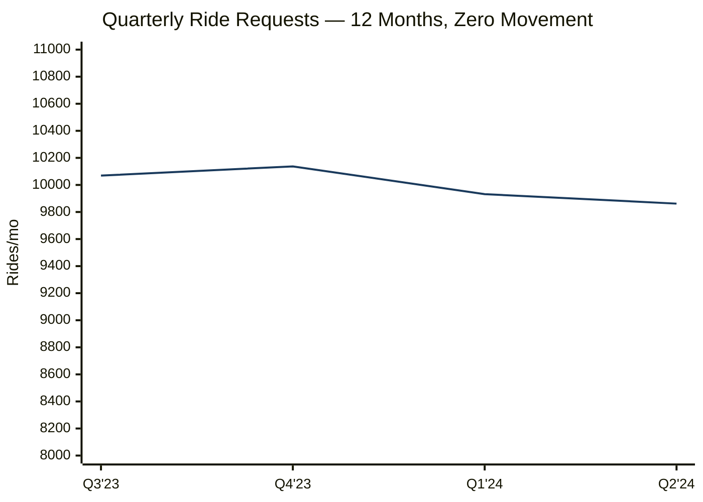

Every promotion, segment campaign, and product feature ran through these 12 months. The line never moved. That is the definition of a structural problem, not a marketing problem.

---

## How These Problems Were Found

All five problems below were discovered through feature engineering on the raw CSV files. None of them are stated in the assessment.

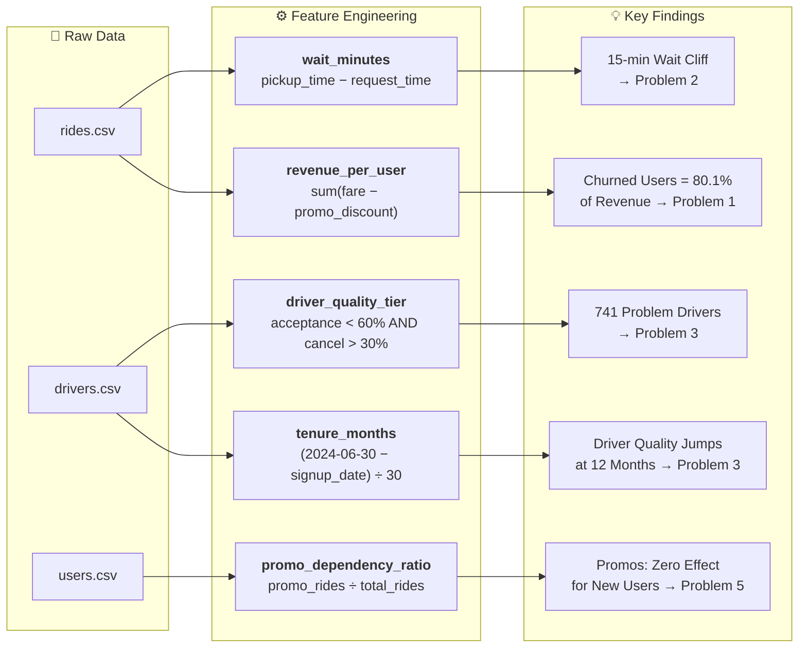

---
---

## Problem 1 — Churned Users Generated 80.1% of Revenue Before They Left

> *Not stated in the assessment. The 79.6% rate, city-by-city uniformity, revenue skew, and activation gap all come from EDA on users.csv and rides.csv.*

**Problem Statement**

79.6% of all 35,000 registered users are inactive. This rate is nearly identical across every single city (78.8%–80.7%), meaning this is not a local problem — it is a platform-wide product failure. More critically: the users who churned were not low-value. They generated **$2,870,285** (80.1% of all gross fare revenue) before going inactive, and their average fare contribution ($103.00) was higher than the average active user ($100.03).

---

**Evidence**

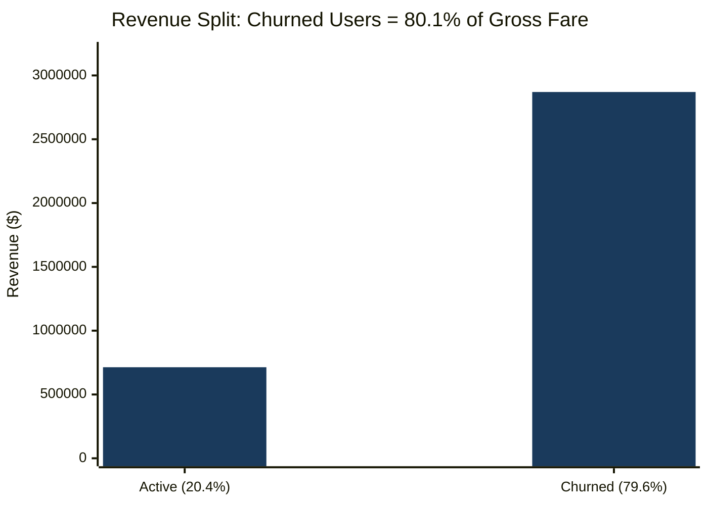

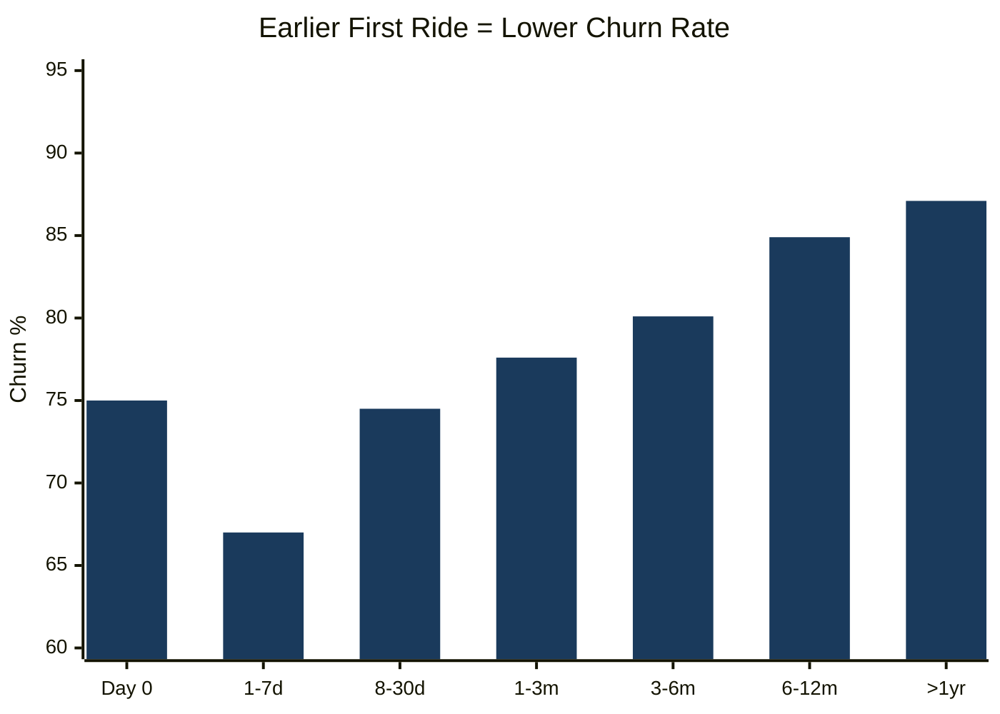

*Source: users.csv `signup_date` joined with `min(request_time)` from rides.csv per user.*
*Note: Same-day group = only 48 users, directional only. All other groups have 1,076–9,566 users.*

Users who took their first ride within 7 days of signup churn at **67.0%**. Users who waited over a year churn at **87.5%**. Both groups average 29–32 lifetime rides — the difference is not how much they ride, it is whether early habit forms.

**What the data rules out:** The churn rate across all 12 cities spans only 78.8%–80.7% — less than 2 percentage points. This rules out city-level supply, local competition, or geography as the cause. The failure is in the core product experience.

---

**Root Cause Hypothesis**

The platform is not converting sign-ups into early riding habits. Promo programs for new users give discounts — but a discount does not guarantee the user gets a driver on time. If the first or second ride involves a long wait or a driver cancellation (Problem 2), the user does not return regardless of what they paid. The product experience, not pricing, is the retention gate.

---

**Recommended Action**

1. **Priority dispatch for the first 3 rides.** When a new user requests their first three rides, route them to the nearest available high-quality driver (acceptance rate ≥70%, cancellation rate ≤15%) ahead of the standard queue. No time promise is made to the user — the improvement is operational and silent. This directly addresses the activation gap: the users most likely to churn are the ones who had a poor early experience, so protecting the early rides is the highest-leverage intervention.
2. **Targeted reactivation for 5,257 high-value churned users** (top 20% by lifetime rides, median 218 days inactive, avg 54 rides each). Offer a single-ride credit with no expiry pressure — not a discount countdown. The goal is to get one good experience, not to trigger a urgency purchase. Pair it with priority dispatch (same as above) so the return ride is more likely to complete cleanly.

---

**Success Metric**

- 30-day retention (% of new users completing ≥2 rides in first 30 days) rises from **19.8%–27.9% → ≥30%** within 2 signup cohort months
- High-value churned user return rate: **≥15%** within 60 days of reactivation outreach

---
---

## Problem 2 — Completion Collapses at Exactly 15 Minutes Wait Time

> *Not mentioned anywhere in the assessment. Discovered by engineering `wait_minutes = (pickup_time − request_time)` and computing completion rate per bracket.*

**Problem Statement**

When a user waits more than 15 minutes for a driver to arrive, only **54.1%** of those rides complete — versus 86.2% when the wait is under 5 minutes. That is a 32-point drop at a single threshold. 9,132 rides (7.6% of all rides) cross this threshold. In the 15–20 minute bracket specifically, the driver cancels 29.3% of the time — after the user has already been waiting. This is the single worst user experience on the platform.

---

**Evidence**

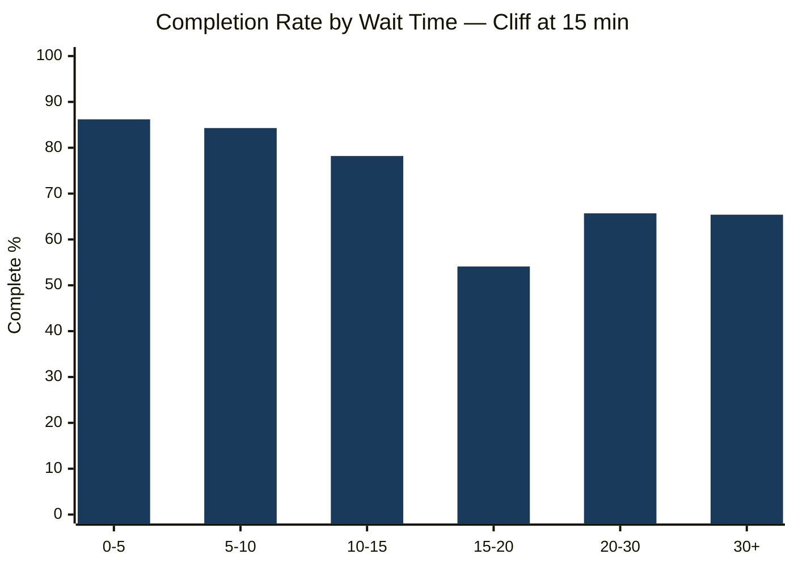

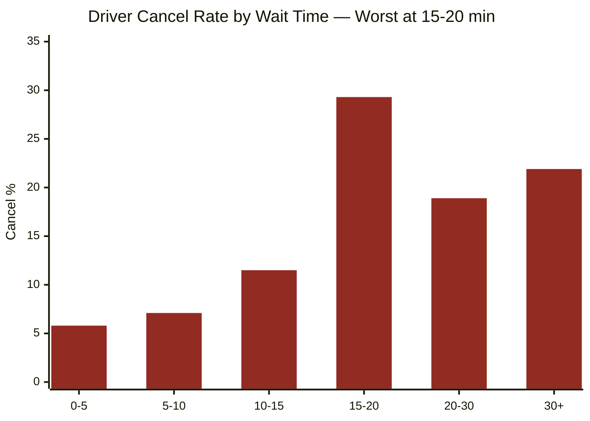

| Wait bracket | Rides | Completion | Driver cancel |
|:-------------|------:|:----------:|:-------------:|
| 0–5 min | 30,685 | 86.2% | 5.8% |
| 5–10 min | 53,352 | 84.3% | 7.1% |
| 10–15 min | 26,831 | 78.2% | 11.5% |
| **15–20 min** | **6,646** | **54.1%** | **29.3%** |
| 20–30 min | 1,649 | 65.7% | 18.9% |
| 30+ min | 837 | 65.4% | 21.9% |

---

**Root Cause Hypothesis**

The threshold effect points to a dispatch retry mechanism. When a driver declines or cancels after accepting, the system reassigns to another driver — each retry adds minutes. Once enough time has passed (around 15 minutes), the user loses confidence and either cancels themselves or the driver — who is now far away — abandons the trip. Problem 3 identifies exactly which drivers are causing this.

---

**Recommended Action**

Reduce the pool of drivers causing retries (see Problem 3). In parallel, introduce a **user-visible wait countdown** with a hard cap: if a driver has not arrived within 12 minutes, automatically reassign to a closer available driver and notify the user. This keeps the user informed and breaks the silent-failure experience.

---

**Success Metric**

- % rides with wait >15 min falls from **7.6% → ≤3%** within 60 days
- Driver cancellation rate in the 15–20 min bracket falls below **15%** (from 29.3%)
- Guardrail: overall completion rate must not fall

---
---

## Problem 3 — 741 Specific Drivers Cause the Wait Problem, and the Wrong Drivers Are Being Suspended

> *Not mentioned in the assessment. Discovered by engineering `driver_quality_tier` = both_issues (acceptance < 60% AND cancellation > 30%) and joining to rides.csv. The suspension anomaly was found by comparing active vs. suspended driver metrics.*

**Problem Statement**

741 drivers (9.3% of the total fleet) have an acceptance rate below 60% and a cancellation rate above 30% — 588 of them are currently active. These drivers handle 11,174 rides. Among those rides, **43.0%** exceed the 15-minute wait threshold — versus **3.6%** for the 7,259 standard drivers. Their active cancellation rate is 0.422, nearly 4× the standard driver rate of 0.110. These 741 drivers are the primary cause of the wait time cliff in Problem 2.

The suspension data reveals a misalignment: 534 currently **suspended** drivers have a cancellation rate of **0.135** and average rating of **4.14**. The 741 active problem drivers have a cancellation rate of **0.422**. The suspended drivers cancel at less than one-third the rate of the active problem drivers. Whatever criteria is currently triggering suspensions, it is not aligned with the cancellation and acceptance metrics that most directly affect the ride experience.

---

**Evidence**

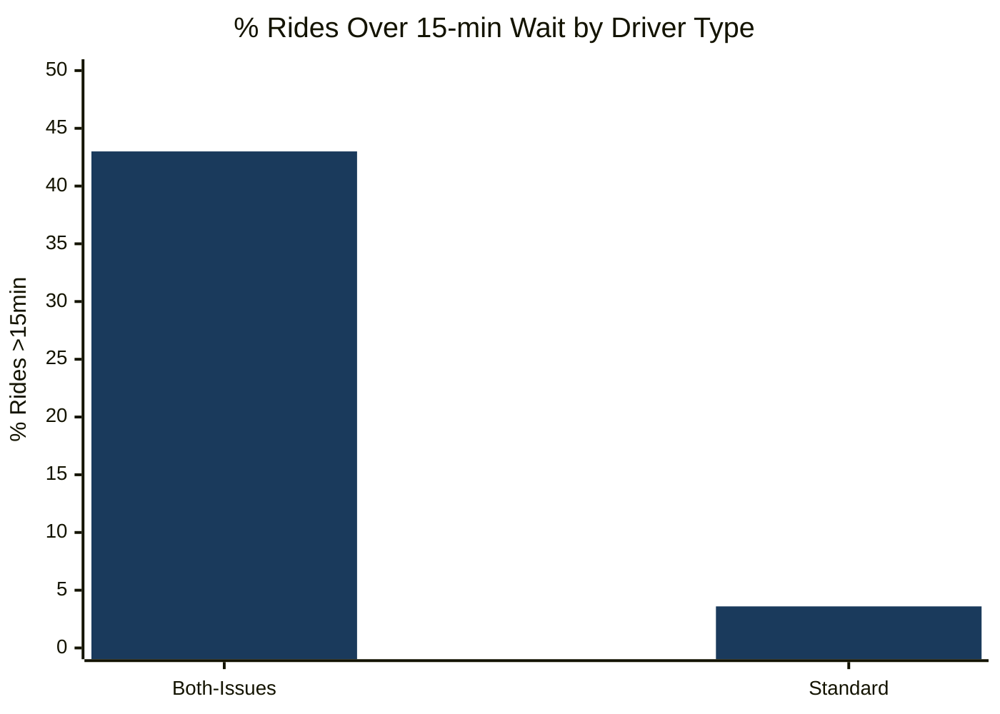

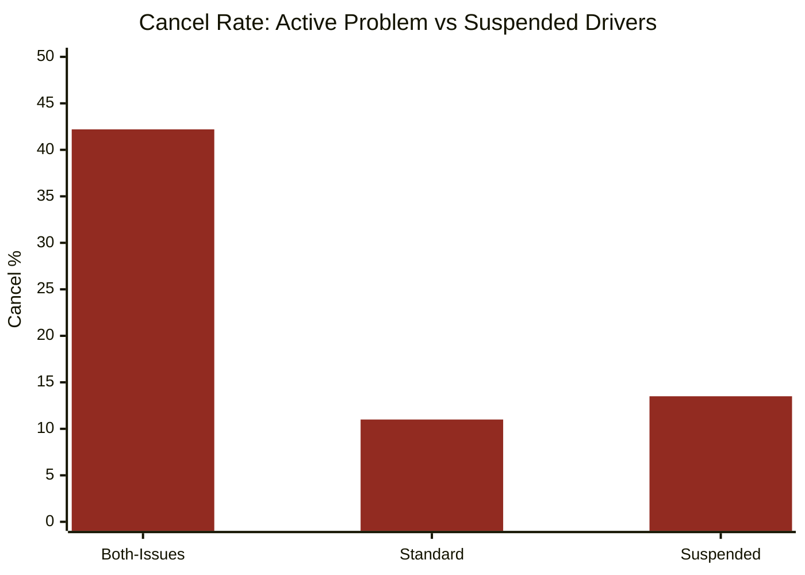

The suspended group (13.5% cancel rate) performs better than the active both-issues group (42.2%). **The wrong drivers are suspended.**

**Driver tenure adds depth (EDA finding from `tenure_months` feature):**

| Tenure (active drivers) | Count | Acceptance | Cancellation | Avg rating |
|:------------------------|------:|:----------:|:------------:|:----------:|
| 6–12 months | 2,082 | 0.726 | **0.220** | **3.914** |
| 12–18 months | 1,332 | 0.840 | **0.101** | **4.250** |
| 18–24 months | 1,370 | 0.839 | 0.100 | 4.256 |
| 24+ months | 1,461 | 0.839 | 0.098 | 4.245 |

Performance improves sharply at the 12-month mark and stays there permanently. 2,082 out of 6,245 active drivers (33.3%) are currently in the below-average early-tenure tier — adding to the pool of drivers that cause long waits and retries.

---

**Root Cause Hypothesis**

Two overlapping causes: (1) 588 currently active both-issues drivers have the lowest acceptance rates and highest cancellation rates on the platform — they are not being removed through the current process. (2) 33.3% of the active fleet is in the early-tenure below-average band, and early driver attrition keeps replenishing this group. Every driver lost before 12 months is replaced by a new below-average driver, keeping quality permanently depressed.

---

**Recommended Action**

1. **30-day performance review for 741 both-issues drivers**: set a minimum threshold — acceptance ≥70% and cancellation ≤20% over a rolling 30-day window. Drivers who do not meet the threshold within 30 days are temporarily deactivated until performance improves. This is an operational change requiring no new technology.
2. **Align deactivation criteria to ride performance metrics**: ensure that rolling 30-day cancellation rate and acceptance rate are included as trigger conditions in the driver review process. The suspended vs. active comparison in the data shows the current criteria is not capturing the worst performers — adding these two metrics closes that gap.
3. **12-month driver tenure incentive**: drivers reaching 12 months with acceptance ≥70% and cancellation ≤15% receive a milestone bonus and preferred dispatch priority. This gives early-tenure drivers a clear, achievable reason to stay past the 12-month quality inflection point.

---

**Success Metric**

- Both-issues active driver count falls from **741 → below 200** within 90 days
- Platform-wide driver cancellation rate falls below **8%** (from current 9.3%)
- Guardrail: active driver count must not fall below 5,500/month

---
---

## Problem 4 — Northgate's Failure Is Concentrated in Two Zones, Not the Whole City

> *Not mentioned in the assessment. Discovered by grouping rides.csv by `city` + `pickup_zone` and computing completion, cancellation, and wait metrics per zone.*

**Problem Statement**

Northgate is the only city that materially underperforms the platform average (completion 76.1% vs 81.4%, avg wait 13.35 min vs 7.84 min). But within Northgate, the failure is entirely concentrated in two zones — **NOR-Z04** and **NOR-Z05** — which together account for 38.4% of all Northgate rides and produce the worst completion rates and longest wait times in the entire dataset. The other Northgate zones (NOR-Z01, NOR-Z03) perform near the platform's best zones. A city-wide intervention would fix the wrong thing.

---

**Evidence**

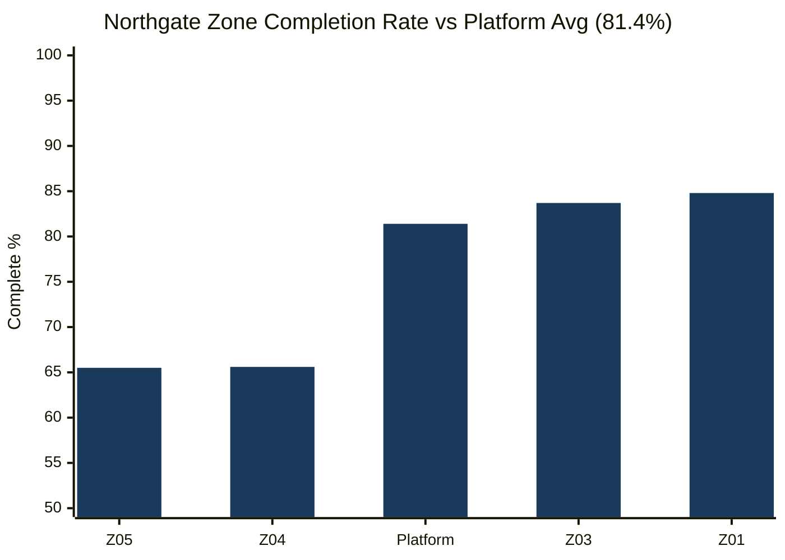

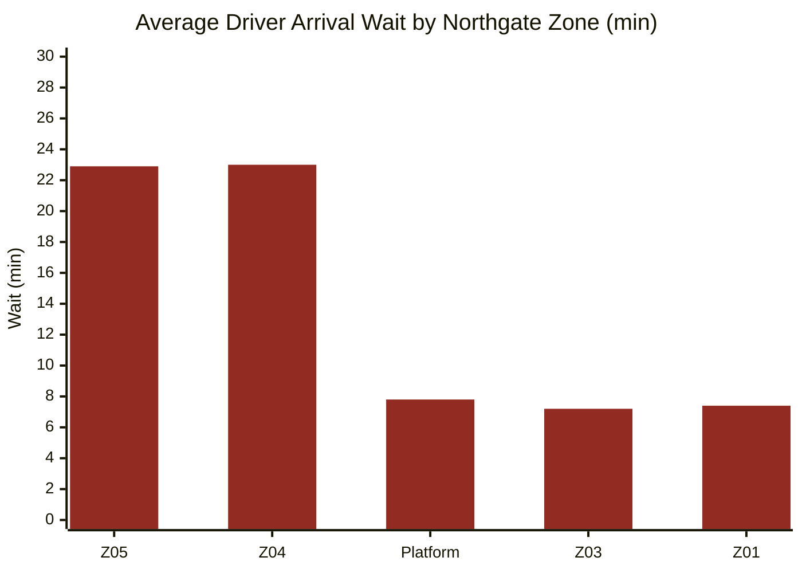

| Zone | Rides | Share of Northgate | Completion | Driver cancel | Avg wait |
|:-----|------:|:------------------:|:----------:|:-------------:|:--------:|
| NOR-Z05 | 1,967 | 19.7% | 65.5% | 20.2% | 22.9 min |
| NOR-Z04 | 1,867 | 18.7% | 65.6% | 20.5% | 23.0 min |
| NOR-Z01 | 1,071 | 10.7% | 84.8% | 7.8% | 7.4 min |
| NOR-Z03 | 1,035 | 10.4% | 83.7% | 8.8% | 7.2 min |

NOR-Z04 and NOR-Z05 combined: **38.4% of Northgate rides**, with a **23-minute average wait** and **65.5–65.6% completion** — the worst in the entire dataset.

NOR-Z01 and NOR-Z03 use the same city-level driver pool and perform at 84.8% and 83.7% — near the platform's best zones. This rules out "Northgate has bad drivers" as an explanation. The problem is geographic — specific zones with thin supply.

---

**Root Cause Hypothesis**

Drivers avoid NOR-Z04 and NOR-Z05 because ride density in those zones is too low to be profitable. Rides requested there require drivers to travel from outside the zone, adding wait time. Long waits → driver cancellations → bad experience → users stop booking → demand drops → drivers have even less reason to be there. This is a self-reinforcing cycle that does not affect NOR-Z01 and NOR-Z03 because they have sufficient local density.

---

**Recommended Action**

Zone-targeted supply fix for **NOR-Z04 and NOR-Z05 only** — do not touch NOR-Z01 or NOR-Z03. NOR-Z01 and NOR-Z03 perform well using the same Northgate driver pool, which confirms this is a positioning problem, not a driver shortage. The fix is to make it worth existing drivers' time to be in the two underserved zones:

- Introduce a **zone presence bonus** for Northgate drivers: any driver who completes ≥5 rides originating from NOR-Z04 or NOR-Z05 in a single day earns a flat daily top-up. This incentivises drivers to position in those zones without requiring any new hiring.
- Set this incentive for **peak hours only** (based on platform-wide demand patterns) to concentrate supply where and when the wait time problem is worst, not as an all-day payment.

---

**Success Metric**

- NOR-Z04 and NOR-Z05 average wait falls from **23 min → below 12 min** within 90 days
- Completion rate in these zones rises from **65.5% → above 75%**
- Guardrail: NOR-Z01 and NOR-Z03 completion must not fall — supply must not be cannibalized from working zones

---
---

## Problem 5 — Promo Spend Is Concentrated on the Exact Users Where It Has No Measurable Effect

> *Discovered by engineering `promo_dependency_ratio = promo_rides ÷ total_rides`, computing Q1–Q4 quartiles, and running a controlled analysis by ride frequency bracket.*

**Problem Statement**

RideFast's promo spend is concentrated on new and early users — those with 1–25 lifetime rides at most. The data shows that within this group, heavy promo users (Q4) and light promo users (Q1) churn at **identical rates**: 82.7% vs 82.7% for 1–10 ride users. The promo–retention effect only appears for users who already ride 26+ times. Promo budget is being spent on the one segment where the data shows no measurable retention effect.

---

**Evidence**
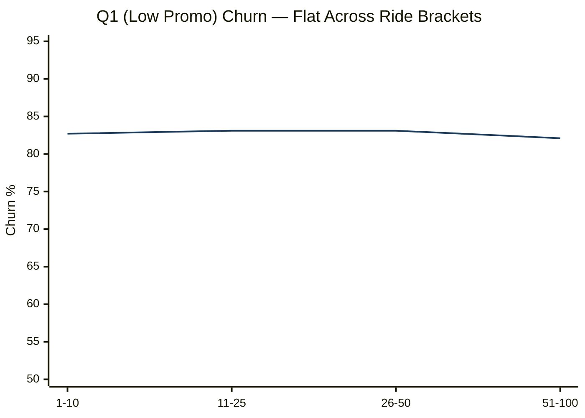

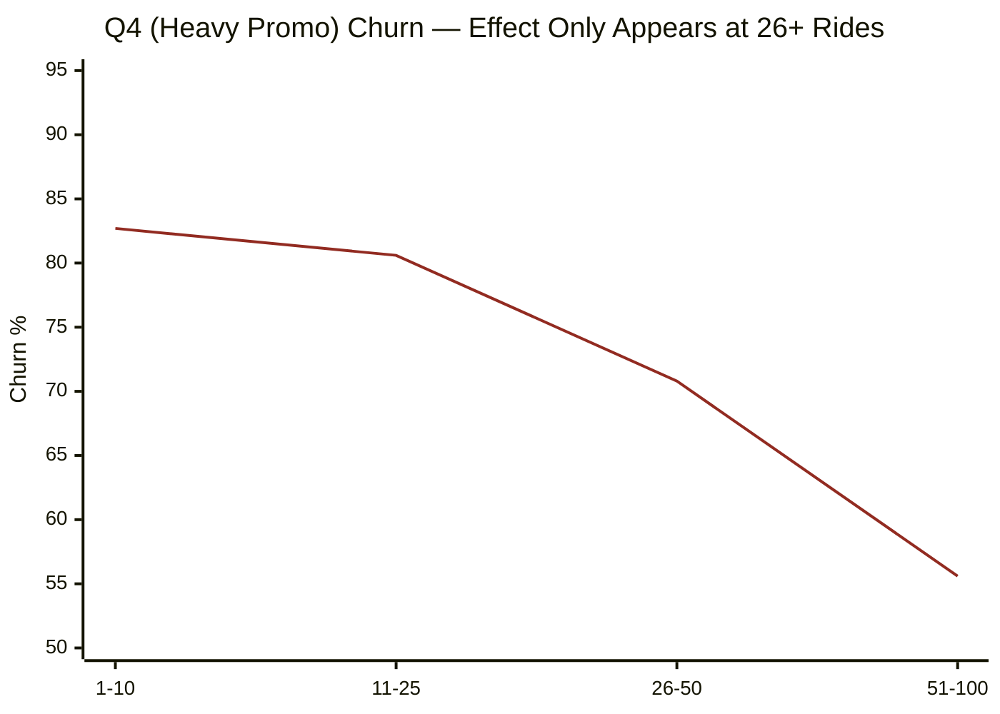

*Blue = Q1 (low promo use) · Red = Q4 (heavy promo use)*

| User ride count | Q1 churn | Q4 churn | Gap | New user cycle applies? |
|:----------------|:--------:|:--------:|:---:|:-----------------------:|
| 1–10 rides | 82.7% | 82.7% | **0.0pp — zero effect** | Yes — this is them |
| 11–25 rides | 83.1% | 80.6% | 2.5pp — minimal | Yes — still them |
| 26–50 rides | 83.1% | 70.8% | 12.3pp — real | No — they already ride frequently |
| 51–100 rides | 82.1% | 55.6% | 26.5pp — very real | No |

The promo effect is real — but only for users who already ride frequently. New users in their first month will have 1–25 rides at most. For them, giving 3 discounts vs 1 discount produces the same churn outcome.

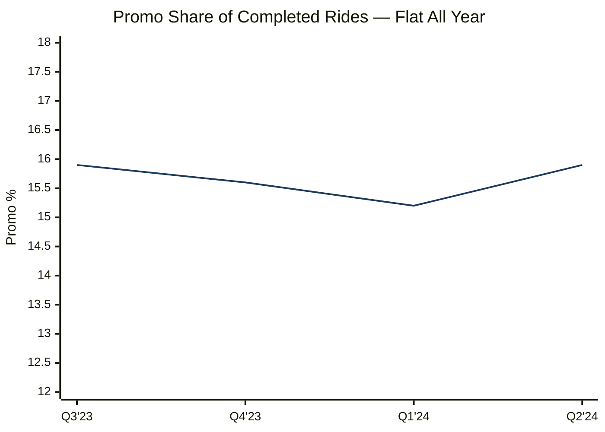

12 months of promos. The share never moved. Neither did volume.

---

**Root Cause Hypothesis**

The promo–retention correlation among 26+ ride users is most likely reverse causality: engaged users naturally encounter and use more promos. Their lower churn is caused by their engagement, not by the promos. For new users, the product experience — specifically whether they get a driver on time (Problem 2) — determines whether they return. No discount compensates for a 20-minute wait and a driver cancellation on ride number one.

> This is the strongest interpretation the data supports. Proving causality requires a holdout test which does not currently exist.

---

**Recommended Action**

Do not cut promos for existing high-frequency users — Q4 users with 26+ rides do show lower churn, and removing promos from this group without a controlled test risks losing them. The data identifies where the spending is wasteful: users with 1–25 rides. Instead, **run a holdout test specifically on new and early-stage users:**

- At activation, randomly split new users: **treatment group receives the current promo configuration**, control group receives minimal or no promo discount
- Measure: completed rides at day 90 for both groups — this is the only metric that matters, not redemption counts
- Guardrail: control group churn must not exceed treatment group by more than 3 percentage points
- If both groups produce similar ride counts at day 90: promo spend on new users is generating no incremental rides — reallocate that budget to the driver quality plan (Problem 3) and the NOR-Z04/Z05 zone incentive (Problem 4)

---

**Success Metric**

- If holdout shows promos are causal: treatment group completes **≥5% more rides** at day 90 → keep the full cycle
- If not: introduce **promo spend per incremental completed ride** as the new efficiency metric; current baseline is unmeasured
- Either way: this experiment answers the most expensive unanswered question in the current strategy

---

## Priority Order

| # | Problem | Source | Why this sequence |
|:-:|:--------|:------:|:------------------|
| 1 | Fix 741 both-issues drivers (Problem 3) | EDA | Directly reduces the 15-min cliff — operational change, no cost |
| 2 | Northgate NOR-Z04 and NOR-Z05 zone supply (Problem 4) | EDA | Geographically specific, bounded fix |
| 3 | First-ride activation commitment (Problem 1) | EDA | Converts the activation gap finding into a product guarantee |
| 4 | Run promo holdout (Problem 5) | EDA | Answers the biggest unanswered budget question |
| 5 | Driver tenure incentive (Problem 3 sub-action) | EDA | 12-month compounding quality improvement |
