# Problem Statement & Recommendations
*RideFast | Jul 2023 – Jun 2024 | rides.csv (120K) · users.csv (35K) · drivers.csv (8K) · support_tickets.csv (22K)*

---

## The Core Problem

RideFast has 35,000 registered users, 8,000 drivers, and runs 10,000+ rides a month across 12 cities. The problem is not that people don't know about the platform. The problem is that they try it once and don't come back.

Ride volume has been flat for 12 straight months. Every promo and product update ran during this period. Nothing moved.

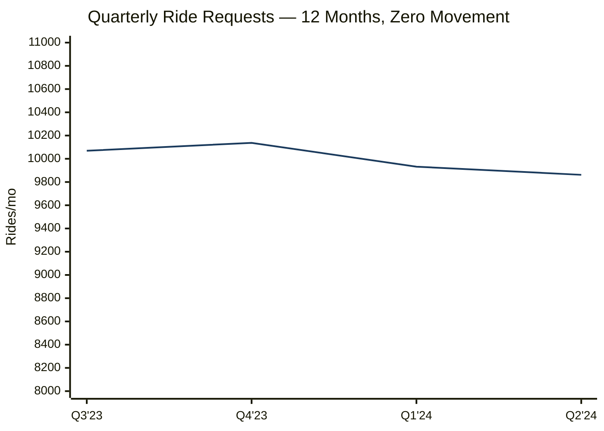

The five problems below came directly from the data — not from assumptions.

---

## How These Problems Were Found

Five new columns were built from the raw CSV files. Each one revealed a different problem.

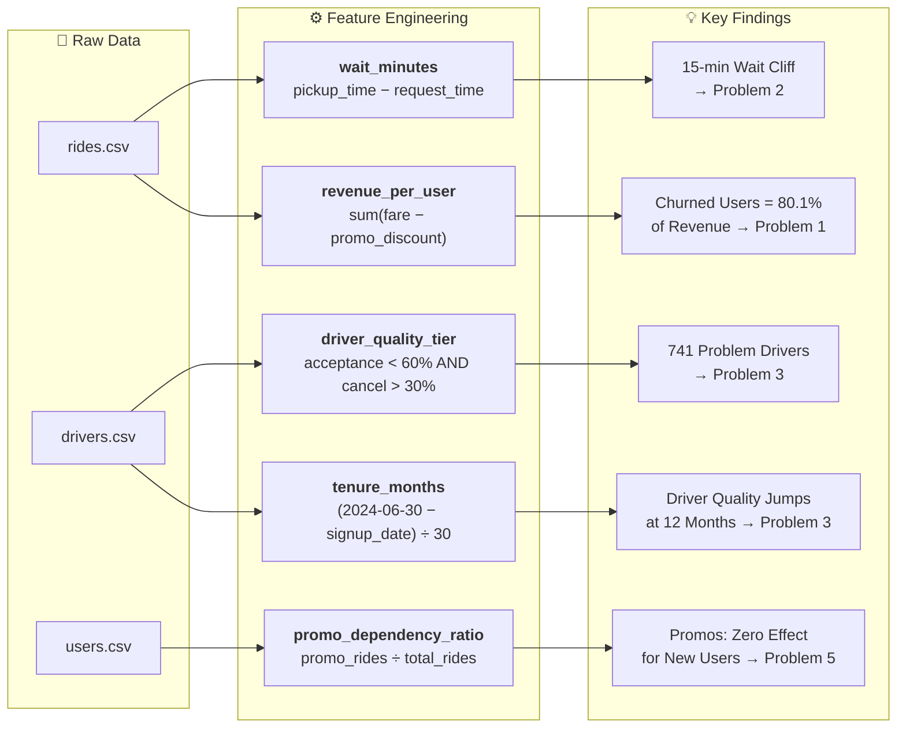

---

## Problem 1 — The Users Who Left Were the Most Valuable Ones

> *Source: users.csv joined with rides.csv*

**What the data shows**

79.6% of all 35,000 users are inactive. This rate barely changes across all 12 cities — it sits between 78.8% and 80.7% everywhere. That means it is not a city-specific issue. It is a platform-wide pattern.

The bigger problem: churned users were not low-value. They generated **$2,870,285** — 80.1% of all revenue — before going quiet. Their average spend ($103.00) was actually higher than active users ($100.03).

**Evidence**

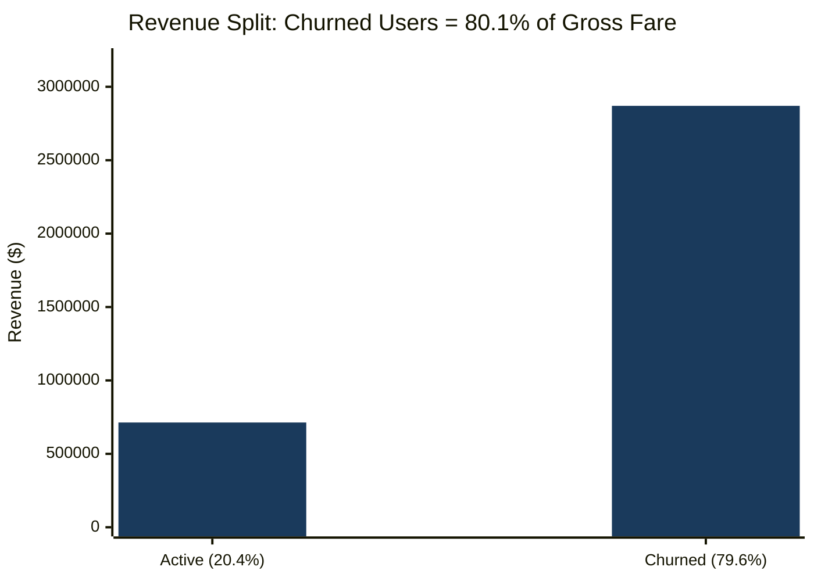

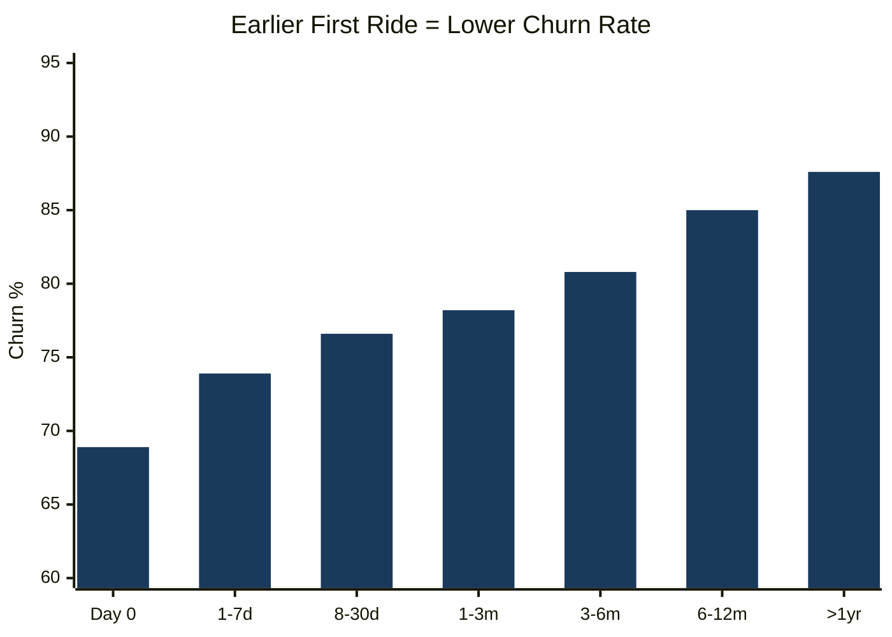

*Source: users.csv `signup_date` joined with `min(request_time)` from rides.csv per user.*
*Note: Same-day group = only 45 users, directional only. All other groups have 376–9,856 users.*

Users who ride within 7 days of signup churn at 73.9%. Users who wait over a year churn at 87.6%. Both groups average 29–32 lifetime rides — the difference is just whether they built the habit early.

**Why it's happening**

Discounts get users to sign up, but they don't guarantee a good first experience. If that first ride has a long wait or a driver cancellation, the user doesn't come back — no matter what they paid.

**What to do**

1. For new users' first 3 rides, silently route them to the nearest high-quality driver (acceptance ≥70%, cancellation ≤15%). No visible promise to the user — just a better experience behind the scenes.
2. Send a single ride credit to the 5,257 high-value churned users (those with the most lifetime rides, inactive for a median 218 days). Pair it with the same priority dispatch so their return ride actually goes well.

**Success Metric**
- New user 30-day retention (≥2 rides in 30 days): **22.5%–27.0%** across signup cohorts — track upward shift 60 days post-rollout
- High-value churned user return rate: no prior baseline — measure within 60 days of first outreach campaign

---

## Problem 2 — Rides Fall Apart After 15 Minutes of Waiting

> *Source: `wait_minutes` feature engineered from rides.csv*

**What the data shows**

When a user waits under 5 minutes, 86.2% of rides complete. When they wait over 15 minutes, only 54.1% complete. That is a 32-point drop. Worse, in the 15–20 minute window, the *driver* cancels 29.3% of the time — after the user has already been waiting.

9,132 rides (7.6% of all rides) cross the 15-minute mark.

**Evidence**

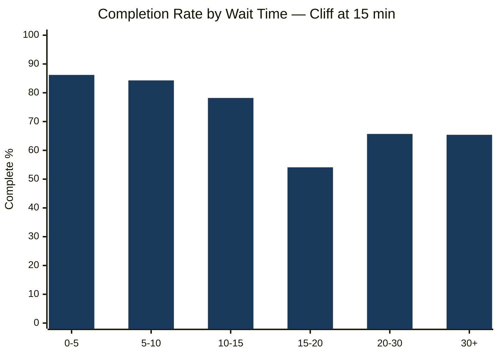

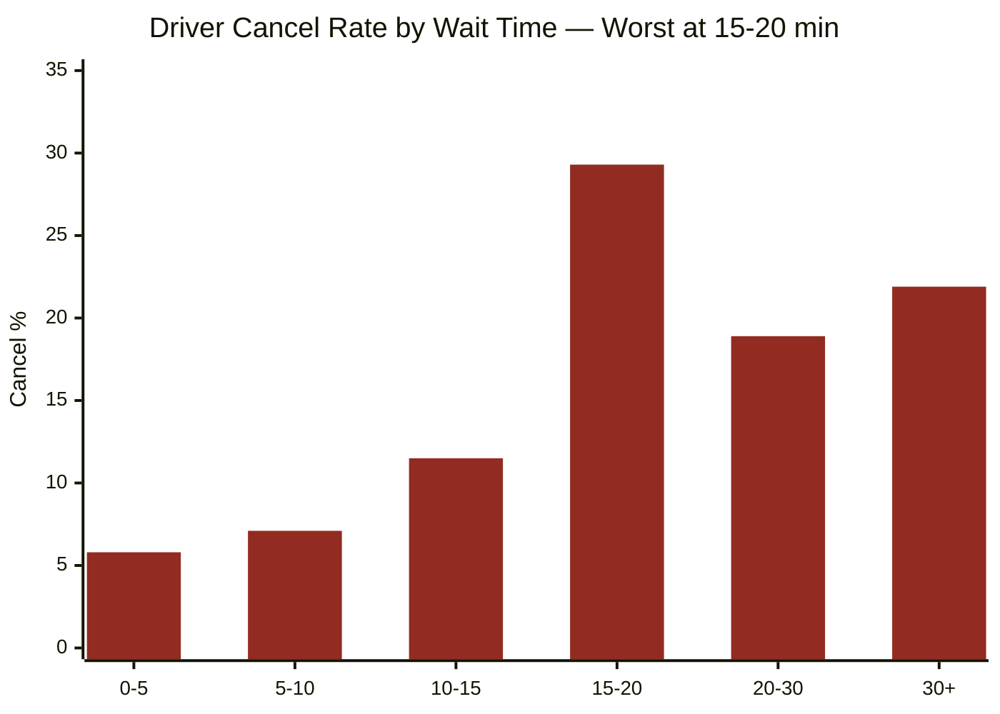

| Wait bracket | Rides | Completion | Driver cancel |
|:-------------|------:|:----------:|:-------------:|
| 0–5 min | 30,685 | 86.2% | 5.8% |
| 5–10 min | 53,352 | 84.3% | 7.1% |
| 10–15 min | 26,831 | 78.2% | 11.5% |
| **15–20 min** | **6,646** | **54.1%** | **29.3%** |
| 20–30 min | 1,649 | 65.7% | 18.9% |
| 30+ min | 837 | 65.4% | 21.9% |

**Why it's happening**

When a driver declines or cancels, the system reassigns to another — each retry adds minutes. Around the 15-minute mark the user loses confidence, and the next driver (now far away) gives up too. Problem 3 shows exactly which drivers are triggering this loop.

**What to do**

Fix the driver pool causing retries (Problem 3). Also add a visible wait timer: if the driver hasn't arrived in 12 minutes, auto-reassign to a closer driver and tell the user. Right now users wait in silence, which makes the experience feel worse than it is.

**Success Metric**
- Rides with wait >15 min: **7.6%** — track reduction 60 days after Problem 3 driver fix is live
- Driver cancel rate in 15–20 min bracket: **29.3%** — track weekly post-fix
- Guardrail: overall completion rate must not fall

---

## Problem 3 — 741 Drivers Are Causing Most of the Wait Problem

> *Source: `driver_quality_tier` feature from drivers.csv joined with rides.csv*

**What the data shows**

741 drivers (9.3% of the total fleet) have acceptance below 60% and cancellation above 30% — 588 of them are currently active. Among rides assigned to them, **43.0% cross the 15-minute wait threshold** — versus just 2.8% for the 7,041 standard-tier drivers. They are the direct cause of the cliff in Problem 2.

There is also a mismatch in who is currently suspended: 534 suspended drivers have a cancellation rate of 0.135 and an average rating of 4.14. The 588 active both-issues drivers cancel at 0.422 — more than 3× higher. The suspended group actually performs better than the active problem group on the metrics that matter most.

**Evidence**

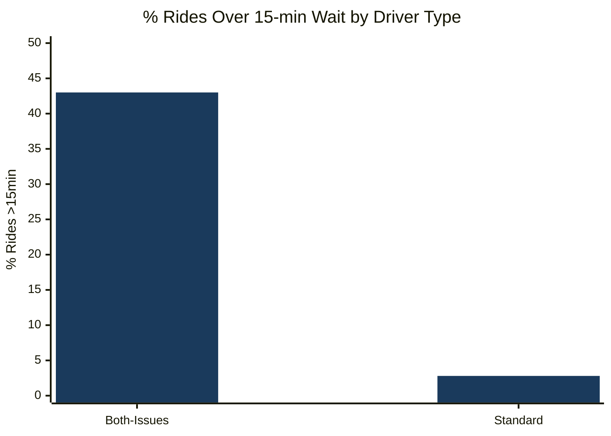

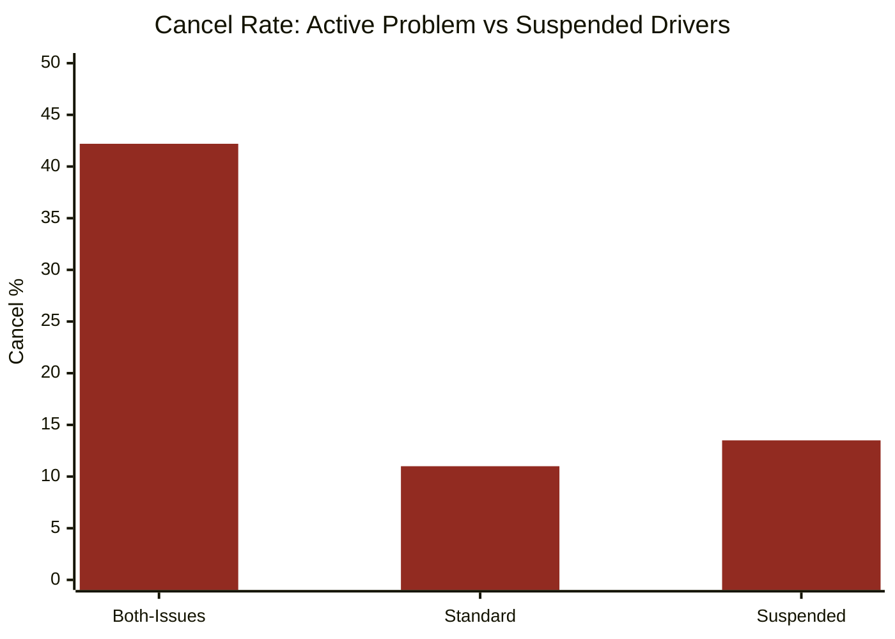

Driver quality also improves significantly after 12 months on the platform and stays there:

| Tenure (active drivers) | Count | Acceptance | Cancellation | Avg rating |
|:------------------------|------:|:----------:|:------------:|:----------:|
| 6–12 months | 2,125 | 0.728 | **0.217** | **3.921** |
| 12–18 months | 1,339 | 0.839 | **0.101** | **4.250** |
| 18–24 months | 1,396 | 0.839 | 0.100 | 4.258 |
| 24+ months | 1,376 | 0.839 | 0.098 | 4.243 |

34.0% of active drivers (2,125 out of 6,245) are still in the early below-average window. When drivers leave before 12 months, they get replaced by new below-average ones — keeping quality stuck.

**Why it's happening**

The 741 problem drivers are still active because the current deactivation process is not using cancellation rate and acceptance rate as triggers. Separately, early driver attrition means the below-average pool keeps refilling itself.

**What to do**

1. Give all 741 both-issues drivers 30 days to hit acceptance ≥70% and cancellation ≤20%. Drivers who don't hit the threshold get temporarily deactivated. No new tech needed — this is just an operational decision.
2. Add rolling 30-day cancellation rate and acceptance rate as formal deactivation triggers so the current mismatch (worse active drivers, better suspended ones) stops happening.
3. Give drivers who reach 12 months with good metrics a milestone bonus and dispatch priority — something worth staying for.

**Success Metric**
- Active both-issues drivers: **588** currently active — track reduction 90 days post-enforcement
- Platform-wide driver cancel rate (rides.csv): **9.3%** — track improvement
- Guardrail: active driver count must stay above 5,500/month

---

## Problem 4 — Northgate's Problem Is Two Specific Zones, Not the Whole City

> *Source: rides.csv grouped by `city` + `pickup_zone`*

**What the data shows**

Northgate is the only city clearly underperforming the platform (76.1% completion vs 81.4% average, 13.35 min avg wait vs 7.84 min). But inside Northgate, two zones — **NOR-Z04 and NOR-Z05** — are causing all of it. Together they are 38.4% of Northgate's rides and have the worst numbers in the entire dataset.

The other two Northgate zones (NOR-Z01, NOR-Z03) perform near the platform's best. They use the same city driver pool. So the issue is not "Northgate has bad drivers" — it is that drivers are not positioning in Z04 and Z05.

**Evidence**

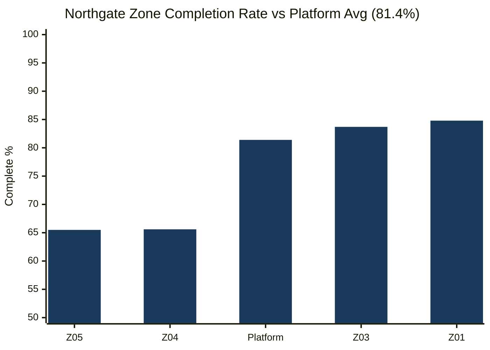

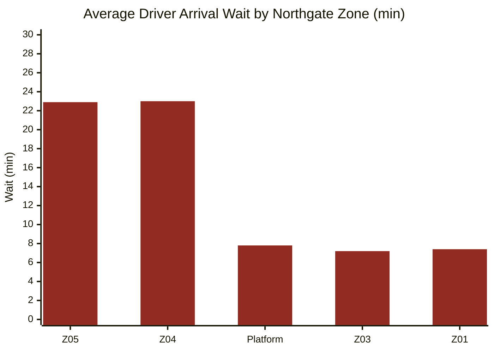

| Zone | Rides | Share of Northgate | Completion | Driver cancel | Avg wait |
|:-----|------:|:------------------:|:----------:|:-------------:|:--------:|
| NOR-Z05 | 1,967 | 19.7% | 65.5% | 20.2% | 22.9 min |
| NOR-Z04 | 1,867 | 18.7% | 65.6% | 20.5% | 23.0 min |
| NOR-Z01 | 1,071 | 10.7% | 84.8% | 7.8% | 7.4 min |
| NOR-Z03 | 1,035 | 10.4% | 83.7% | 8.8% | 7.2 min |

**Why it's happening**

Ride density in Z04 and Z05 is low, so trips there are not worth a driver's time. Drivers stay away, waits get long, users cancel or have bad experiences, demand falls further — and drivers have even less reason to go there. Z01 and Z03 don't have this problem because they already have enough demand to be worth a driver's time.

**What to do**

Only touch Z04 and Z05 — Z01 and Z03 are fine. Since the same driver pool covers all of Northgate, this is a positioning problem, not a headcount one:

- Give existing Northgate drivers a flat daily bonus for completing ≥5 rides originating from Z04 or Z05 in a single day. This makes it worth their time to be in those zones.
- Apply this incentive during peak hours only so the cost is focused where the problem is worst.

**Success Metric**
- Z04 and Z05 average wait: **23 min** — track toward platform average (7.8 min) within 90 days
- Completion rate in these zones: **65.5%** — track toward non-problem Northgate zones (83–85%)
- Guardrail: Z01 and Z03 completion must not fall

---

## Problem 5 — Promo Spend Is Heaviest Where It Makes No Difference

> *Source: `promo_dependency_ratio` feature from rides.csv and users.csv*

**What the data shows**

Most promo spend goes to new and early users — people with 1–25 rides. But for this group, heavy promo users (Q4) and light promo users (Q1) churn at exactly the same rate: **82.7% vs 82.7%** for users with 1–10 rides. There is zero difference.

The promo–churn gap only shows up for users who already ride 26+ times. Those are not new users — they are already engaged regulars.

**Evidence**

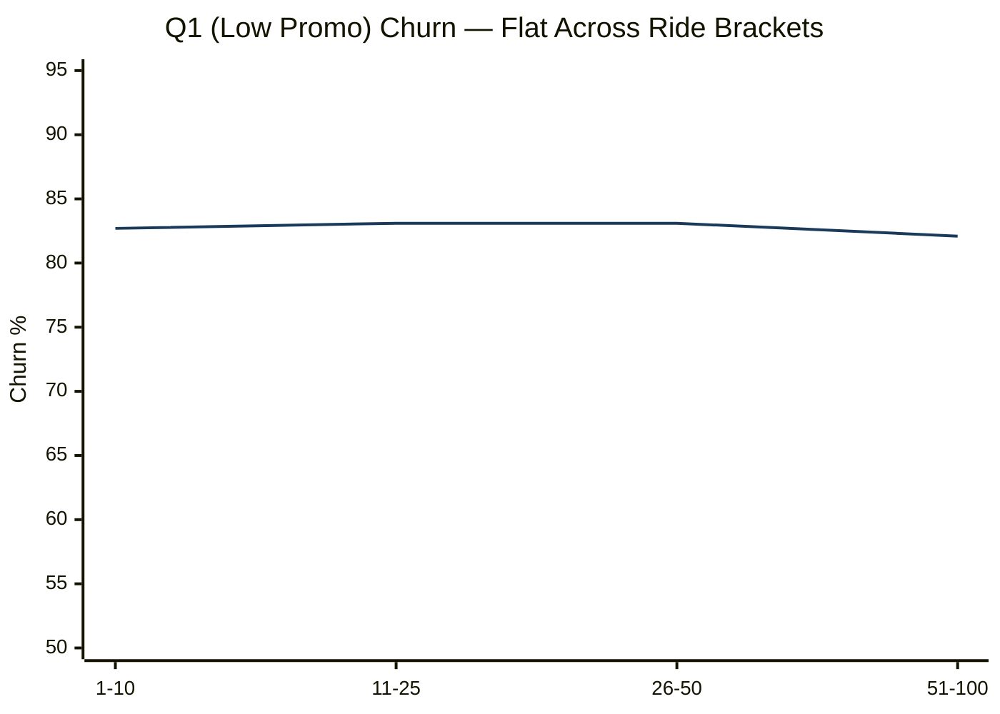

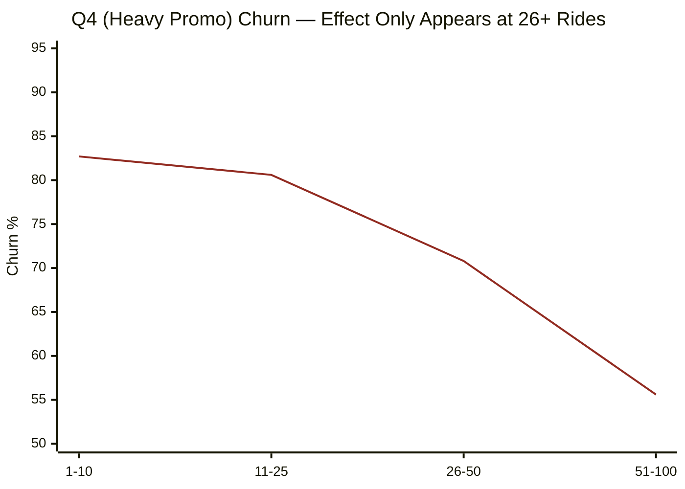

*Blue = Q1 (low promo use) · Red = Q4 (heavy promo use)*

| User ride count | Q1 churn | Q4 churn | Gap |
|:----------------|:--------:|:--------:|:---:|
| 1–10 rides | 82.7% | 82.7% | **0.0pp — zero effect** |
| 11–25 rides | 83.1% | 80.6% | 2.5pp — minimal |
| 26–50 rides | 83.1% | 70.8% | 12.3pp — real |
| 51–100 rides | 82.1% | 55.6% | 26.5pp — very real |

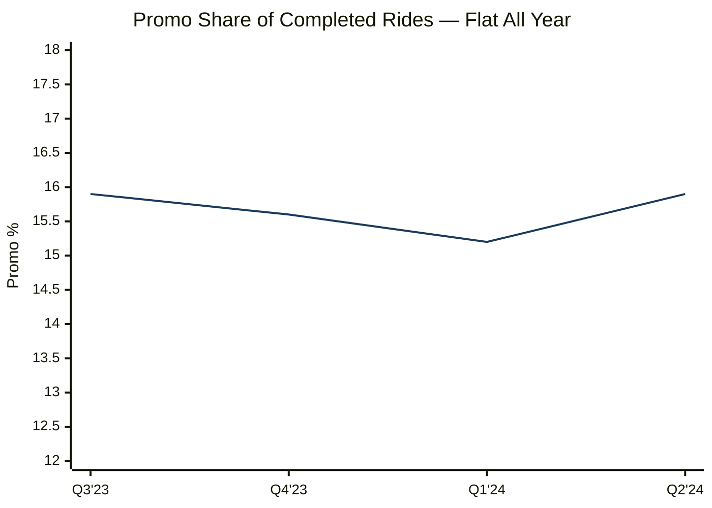

Promo share stayed between 15.2% and 15.9% all year. Ride volume did not move.

**Why it's happening**

For frequent riders, promos and engagement are probably correlated — they ride more, so they use more promos. Their lower churn is likely driven by their engagement, not the discounts. For new users, the experience (specifically Problem 2) is what decides whether they return. A discount does not make up for a 20-minute wait and a driver cancellation.

> The data shows correlation, not causation. Proving it requires a holdout test.

**What to do**

Don't cut promos for 26+ ride users — the data shows they do respond, and removing promos without a test is a risk. Instead, test whether promos actually work for new users:

- Split new users at activation: treatment group gets the current promo setup, control group gets minimal or no discount
- Track completed rides at day 90 — not redemptions, actual rides
- If both groups produce similar ride counts: the promo spend on new users is not working — move that budget to the driver fix (Problem 3) and the Northgate zone incentive (Problem 4)

**Success Metric**
- If promos are causal: treatment group completes statistically significantly more rides at day 90 → keep current setup
- If not: redirect new-user promo budget to Problems 3 and 4, which have direct operational evidence

---

## Priority Order

| # | Problem | Why First |
|:-:|:--------|:----------|
| 1 | Fix 741 both-issues drivers (P3) | Directly reduces the 15-min wait cliff. Operational change, no cost. |
| 2 | Z04 and Z05 zone incentive (P4) | Contained, zone-specific fix with a clear before/after test. |
| 3 | Priority dispatch for new users (P1) | Protects the first experience once the driver pool is cleaner. |
| 4 | Run promo holdout (P5) | Answers the most expensive open question in the current budget. |
| 5 | Driver tenure incentive (P3 sub-action) | Compounds over time — starts the quality improvement pipeline. |
